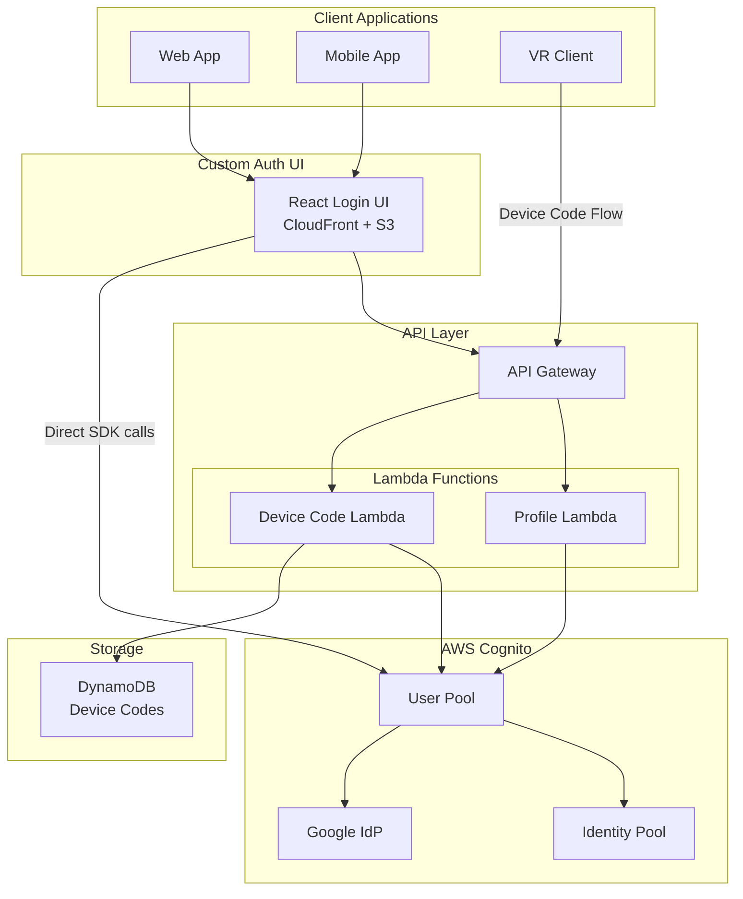
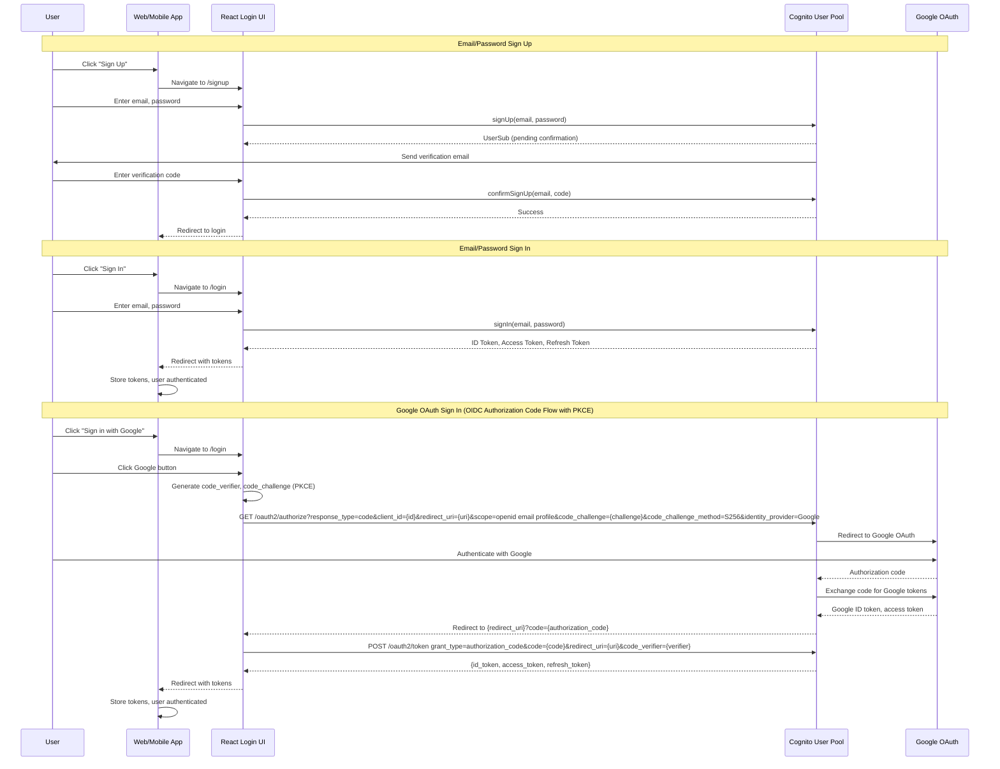
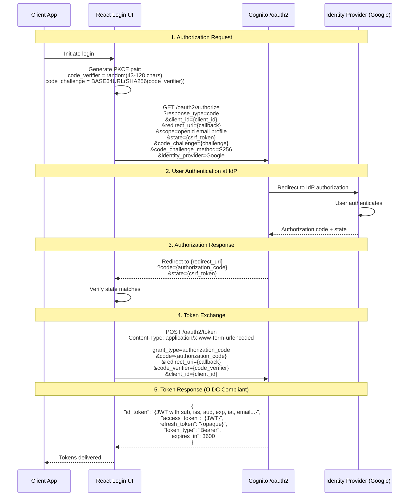
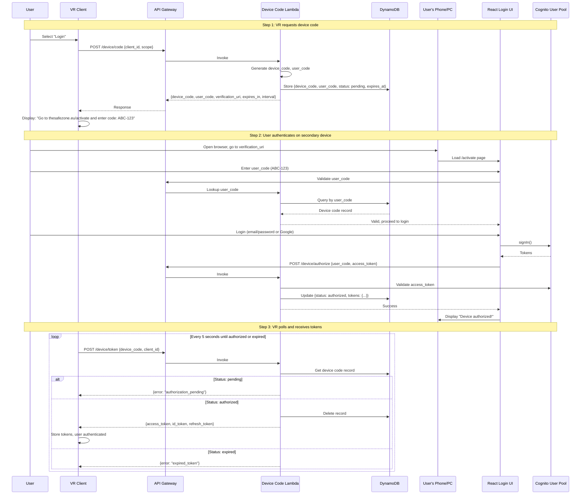
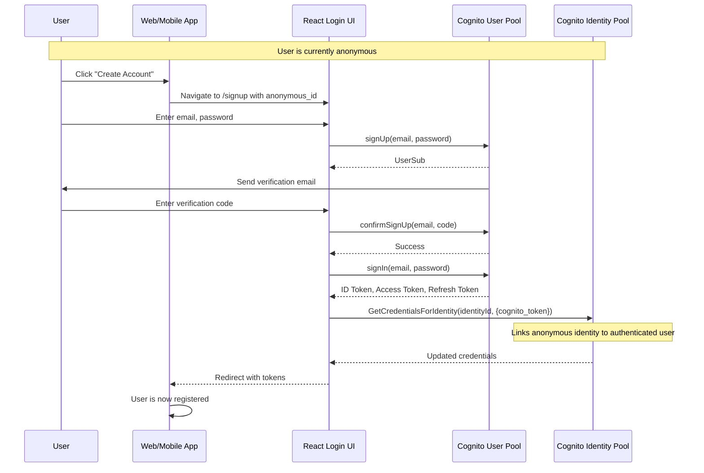

# Design Document: TheSafeZone Identity Provider

## Overview

TheSafeZone IDP is an OAuth2/OpenID Connect compliant identity provider built on AWS Cognito, serving the TheSafeZone Social VR platform. The system provides authentication for web, mobile, and VR clients through a custom React-based login UI, supporting email/password registration, Google federation, and anonymous authentication via Cognito Identity Pools.

The architecture prioritizes:
- Standard OIDC compliance for interoperability
- Custom UI for branded experience
- Device Code Flow for VR authentication
- Serverless implementation using Lambda, API Gateway, and DynamoDB
- Infrastructure as Code using AWS CDK (TypeScript)

## Architecture



### Component Responsibilities

| Component | Responsibility |
|-----------|----------------|
| React Login UI | Custom branded authentication interface, calls Cognito directly via SDK |
| API Gateway | REST API routing for Device Code and Profile operations |
| Device Code Lambda | RFC 8628 Device Code Flow implementation |
| Profile Lambda | User profile CRUD, progressive profiling |
| Cognito User Pool | User storage, token issuance, Google federation |
| Cognito Identity Pool | Anonymous user identity management (no profile storage) |
| DynamoDB (Device Codes) | Temporary storage for device code flow state |

### Frontend-to-Cognito Direct Integration

The React Login UI communicates directly with Cognito using `amazon-cognito-identity-js` or AWS Amplify Auth:

| Operation | Cognito SDK Method |
|-----------|-------------------|
| Sign Up | `signUp()` |
| Confirm Sign Up | `confirmSignUp()` |
| Sign In | `signIn()` / `initiateAuth()` |
| Sign Out | `signOut()` / `globalSignOut()` |
| Forgot Password | `forgotPassword()` |
| Confirm Password Reset | `forgotPasswordSubmit()` |
| Get Current User | `getCurrentUser()` |
| Refresh Session | `refreshSession()` |
| Google OAuth | Redirect to Cognito OAuth endpoint |

## Sequence Diagrams

### Web App / Mobile App Authentication Flow



### OIDC Authorization Code Flow with PKCE (Detailed)

This flow is used for all OAuth-based authentication (Google, future social providers).



### Anonymous Authentication Flow


### Device Code Flow (VR Client)



### Anonymous to Registered Upgrade Flow


| Sign Up | `signUp()` |
| Confirm Sign Up | `confirmSignUp()` |
| Sign In | `signIn()` / `initiateAuth()` |
| Sign Out | `signOut()` / `globalSignOut()` |
| Forgot Password | `forgotPassword()` |
| Confirm Password Reset | `forgotPasswordSubmit()` |
| Get Current User | `getCurrentUser()` |
| Refresh Session | `refreshSession()` |
| Google OAuth | Redirect to Cognito OAuth endpoint |

## Components and Interfaces

### 1. Device Code Lambda

Implements RFC 8628 Device Authorization Grant for VR clients.

```typescript
// Endpoints
POST /device/code          // Generate device code and user code
POST /device/token         // Poll for tokens (VR client)
POST /device/authorize     // User authorizes device (after login)
```

### 2. Profile Lambda

Manages user profile data for registered users only. Anonymous users do not have profile data.

```typescript
// Endpoints
GET  /profile              // Get current user profile (registered users only)
PUT  /profile              // Update profile attributes (registered users only)
GET  /profile/completion   // Get profile completion status
```

## Data Models

### User Profile (Cognito Custom Attributes)

```typescript
interface CognitoUserAttributes {
  email: string;                    // Standard attribute
  email_verified: boolean;          // Standard attribute
  sub: string;                      // Cognito user ID
  
  // Custom attributes (prefixed with custom:)
  'custom:displayName'?: string;    // Max 256 chars
  'custom:firstName'?: string;      // Max 256 chars
  'custom:lastName'?: string;       // Max 256 chars
  'custom:interests'?: string;      // JSON array, max 2048 chars
}
```

### Device Code (DynamoDB)

```typescript
interface DeviceCodeRecord {
  deviceCode: string;               // Partition key
  userCode: string;                 // GSI for lookup
  clientId: string;
  scope: string;
  expiresAt: number;                // Unix timestamp
  interval: number;                 // Polling interval in seconds
  status: 'pending' | 'authorized' | 'denied' | 'expired';
  userId?: string;                  // Set when authorized
  tokens?: {                        // Set when authorized
    accessToken: string;
    idToken: string;
    refreshToken: string;
  };
  ttl: number;                      // DynamoDB TTL
}
```

### Client Application Configuration

```typescript
interface ClientConfig {
  clientId: string;
  clientName: string;
  clientType: 'public' | 'confidential';
  allowedScopes: string[];
  callbackUrls: string[];
  logoutUrls: string[];
  tokenValidity: {
    accessToken: number;            // Minutes
    idToken: number;                // Minutes
    refreshToken: number;           // Days
  };
}
```

### Token Claims

```typescript
interface IdTokenClaims {
  // Standard OIDC claims
  iss: string;                      // Issuer URL
  sub: string;                      // Subject (user ID)
  aud: string;                      // Audience (client ID)
  exp: number;                      // Expiration time
  iat: number;                      // Issued at
  auth_time: number;                // Authentication time
  
  // Profile claims
  email?: string;
  email_verified?: boolean;
  name?: string;                    // DisplayName
  given_name?: string;              // FirstName
  family_name?: string;             // LastName
  
  // Custom claims
  'custom:interests'?: string;      // JSON array string
  'custom:isAnonymous'?: boolean;
}
```


## Correctness Properties

*A property is a characteristic or behavior that should hold true across all valid executions of a system-essentially, a formal statement about what the system should do. Properties serve as the bridge between human-readable specifications and machine-verifiable correctness guarantees.*

Based on the acceptance criteria analysis, the following correctness properties must be validated through property-based testing:

### Property 1: PKCE Validation
*For any* authorization request, if the request includes a valid code_challenge and code_verifier pair, the authorization SHALL succeed; if the PKCE parameters are missing or invalid, the authorization SHALL fail.
**Validates: Requirements 1.1**

### Property 2: ID Token OIDC Compliance
*For any* authenticated user, the issued ID token SHALL contain all required OIDC claims (iss, sub, aud, exp, iat) with valid formats and values.
**Validates: Requirements 1.2**

### Property 3: Userinfo Response Consistency
*For any* authenticated user, the userinfo endpoint response SHALL contain the same claims as the ID token for that user.
**Validates: Requirements 1.3**

### Property 4: User Registration Idempotence
*For any* valid email and password, registration SHALL create exactly one user; subsequent registration attempts with the same email SHALL fail.
**Validates: Requirements 2.1**

### Property 5: Invalid Credentials Error Uniformity
*For any* invalid credentials (wrong password, non-existent email), the error response SHALL be identical, not revealing whether the email exists.
**Validates: Requirements 2.3**

### Property 6: Password Reset Session Invalidation
*For any* user who completes password reset, all previously issued tokens SHALL become invalid.
**Validates: Requirements 2.5**

### Property 7: Anonymous Identity Uniqueness
*For any* anonymous identity request, the system SHALL return a unique identity ID that persists across subsequent requests with the same device credentials.
**Validates: Requirements 4.1, 4.2**

### Property 8: Upgrade Token Claims
*For any* upgraded user (anonymous to registered), the new tokens SHALL NOT contain the anonymous flag and SHALL contain the registered user's email claim.
**Validates: Requirements 5.3**

### Property 9: Profile Update Round-Trip
*For any* user profile update, the updated values SHALL appear in subsequently retrieved profile data and issued tokens.
**Validates: Requirements 6.1, 6.2, 6.3**

### Property 10: Partial Profile Update Preservation
*For any* partial profile update, fields not included in the update SHALL retain their previous values.
**Validates: Requirements 6.4**

### Property 11: Profile Completion Status Accuracy
*For any* user profile state, the completion status SHALL correctly identify all unpopulated optional fields.
**Validates: Requirements 7.3**

### Property 12: Account Linking Uniqueness
*For any* social account, it SHALL be linked to at most one TheSafeZone user; attempting to link an already-linked account SHALL fail.
**Validates: Requirements 8.1, 8.2**

### Property 13: Multi-Provider Login Equivalence
*For any* user with multiple linked providers, authentication via any linked provider SHALL return tokens with the same user subject (sub) claim.
**Validates: Requirements 8.3**

### Property 14: Unlink Preservation
*For any* user who unlinks a social provider, the user account SHALL continue to exist and be accessible via remaining authentication methods.
**Validates: Requirements 8.4**

### Property 15: Device Code Format and Expiration
*For any* device code request, the generated user_code and device_code SHALL be unique, and the expires_in value SHALL be 600 seconds (10 minutes).
**Validates: Requirements 9.1, 9.2**

### Property 16: Device Code Polling States
*For any* device code, polling before authorization SHALL return "authorization_pending"; polling after authorization SHALL return valid tokens.
**Validates: Requirements 9.4, 9.5**

### Property 17: Client ID Uniqueness
*For any* client registration, the issued client_id SHALL be unique across all registered clients.
**Validates: Requirements 10.1**

### Property 18: Token Audience Correctness
*For any* token request, the issued token's audience (aud) claim SHALL match the requesting client_id.
**Validates: Requirements 10.2**

### Property 19: Cross-Client Identity Consistency
*For any* user authenticating across multiple clients, the subject (sub) claim SHALL be identical in all issued tokens.
**Validates: Requirements 10.3**

### Property 20: Public Client PKCE Enforcement
*For any* public client, authorization requests without PKCE SHALL be rejected; requests with client_secret SHALL be rejected.
**Validates: Requirements 10.4**

### Property 21: Token Lifetime Correctness
*For any* issued token, the access token expiration SHALL be 1 hour from issuance, and refresh token expiration SHALL be 30 days from issuance.
**Validates: Requirements 11.1**

### Property 22: Refresh Token Rotation
*For any* refresh token usage, the response SHALL include new access, ID, and refresh tokens; the original refresh token SHALL become invalid.
**Validates: Requirements 11.2**

### Property 23: Logout Token Revocation
*For any* logout operation, the user's refresh token SHALL become invalid for subsequent refresh attempts.
**Validates: Requirements 11.3**

### Property 24: Token Validation Completeness
*For any* token with invalid signature, expired timestamp, wrong audience, or wrong issuer, validation SHALL fail.
**Validates: Requirements 11.4**

### Property 25: Account Lockout Threshold
*For any* user, exactly 5 consecutive failed login attempts SHALL trigger account lockout; fewer than 5 failures SHALL NOT trigger lockout.
**Validates: Requirements 13.1**

## Error Handling

### Authentication Errors

| Error Code | HTTP Status | Description | User Message |
|------------|-------------|-------------|--------------|
| INVALID_CREDENTIALS | 401 | Wrong email or password | "Invalid email or password" |
| USER_NOT_CONFIRMED | 403 | Email not verified | "Please verify your email" |
| USER_DISABLED | 403 | Account disabled/locked | "Account is temporarily locked" |
| PASSWORD_RESET_REQUIRED | 403 | Admin-initiated reset | "Password reset required" |
| MFA_REQUIRED | 403 | MFA challenge pending | "Additional verification required" |

### Token Errors

| Error Code | HTTP Status | Description |
|------------|-------------|-------------|
| TOKEN_EXPIRED | 401 | Access token expired |
| TOKEN_INVALID | 401 | Malformed or tampered token |
| TOKEN_REVOKED | 401 | Token has been revoked |
| REFRESH_TOKEN_EXPIRED | 401 | Refresh token expired |

### Device Code Errors

| Error Code | HTTP Status | Description |
|------------|-------------|-------------|
| authorization_pending | 400 | User hasn't authorized yet |
| slow_down | 400 | Polling too frequently |
| access_denied | 400 | User denied authorization |
| expired_token | 400 | Device code expired |

### Profile Errors

| Error Code | HTTP Status | Description |
|------------|-------------|-------------|
| PROFILE_NOT_FOUND | 404 | User profile doesn't exist |
| INVALID_INTERESTS | 400 | Interests not valid JSON array |
| ATTRIBUTE_TOO_LONG | 400 | Attribute exceeds max length |
| ANONYMOUS_NO_PROFILE | 403 | Anonymous users cannot access profile features |

## Testing Strategy

### Dual Testing Approach

The testing strategy employs both unit tests and property-based tests:

- **Unit tests** verify specific examples, edge cases, and integration points
- **Property-based tests** verify universal properties that should hold across all inputs

### Property-Based Testing Framework

**Framework:** [fast-check](https://github.com/dubzzz/fast-check) for TypeScript/Node.js

**Configuration:**
- Minimum 100 iterations per property test
- Seed logging for reproducibility
- Shrinking enabled for minimal failing examples

**Annotation Format:**
Each property-based test must include a comment in this format:
```typescript
// **Feature: thesafezone-idp, Property {number}: {property_text}**
```

### Test Categories

#### 1. Token Tests
- Property tests for OIDC compliance (Properties 2, 3)
- Property tests for token lifetime (Property 21)
- Property tests for token validation (Property 24)
- Unit tests for JWT parsing edge cases

#### 2. Authentication Tests
- Property tests for PKCE validation (Property 1)
- Property tests for credential error uniformity (Property 5)
- Property tests for lockout threshold (Property 28)
- Unit tests for specific auth flows

#### 3. Profile Tests (Registered Users Only)
- Property tests for round-trip consistency (Property 9)
- Property tests for partial update preservation (Property 10)
- Property tests for completion status (Property 11)
- Unit tests for JSON interests validation

#### 4. Device Code Tests
- Property tests for code generation (Property 15)
- Property tests for polling states (Property 16)
- Unit tests for expiration handling

#### 5. Account Linking Tests
- Property tests for linking uniqueness (Property 12)
- Property tests for multi-provider equivalence (Property 13)
- Property tests for unlink preservation (Property 14)

#### 6. Anonymous/Upgrade Tests
- Property tests for identity uniqueness (Property 7)
- Property tests for token claims after upgrade (Property 8)

### Test Data Generators

```typescript
// Example generators for property-based tests
const emailGenerator = fc.emailAddress();
const passwordGenerator = fc.string({ minLength: 8, maxLength: 128 });
const displayNameGenerator = fc.string({ minLength: 1, maxLength: 256 });
const interestsGenerator = fc.array(fc.string({ minLength: 1, maxLength: 50 }), { maxLength: 20 });
const clientIdGenerator = fc.uuid();
const deviceCodeGenerator = fc.hexaString({ minLength: 32, maxLength: 32 });
const userCodeGenerator = fc.stringOf(fc.constantFrom(...'ABCDEFGHJKLMNPQRSTUVWXYZ23456789'), { minLength: 8, maxLength: 8 });
```

### Integration Tests

Integration tests cover:
- End-to-end authentication flows
- Cognito User Pool operations
- Cognito Identity Pool operations (anonymous identity only, no profile)
- DynamoDB operations for device codes
- Google OAuth federation (mocked external calls)

### Test Environment

- Local testing with mocked AWS services (aws-sdk-mock, @aws-sdk/client-mock)
- Integration testing against real Cognito in a dedicated test environment
- CI/CD pipeline runs property tests with 100+ iterations
