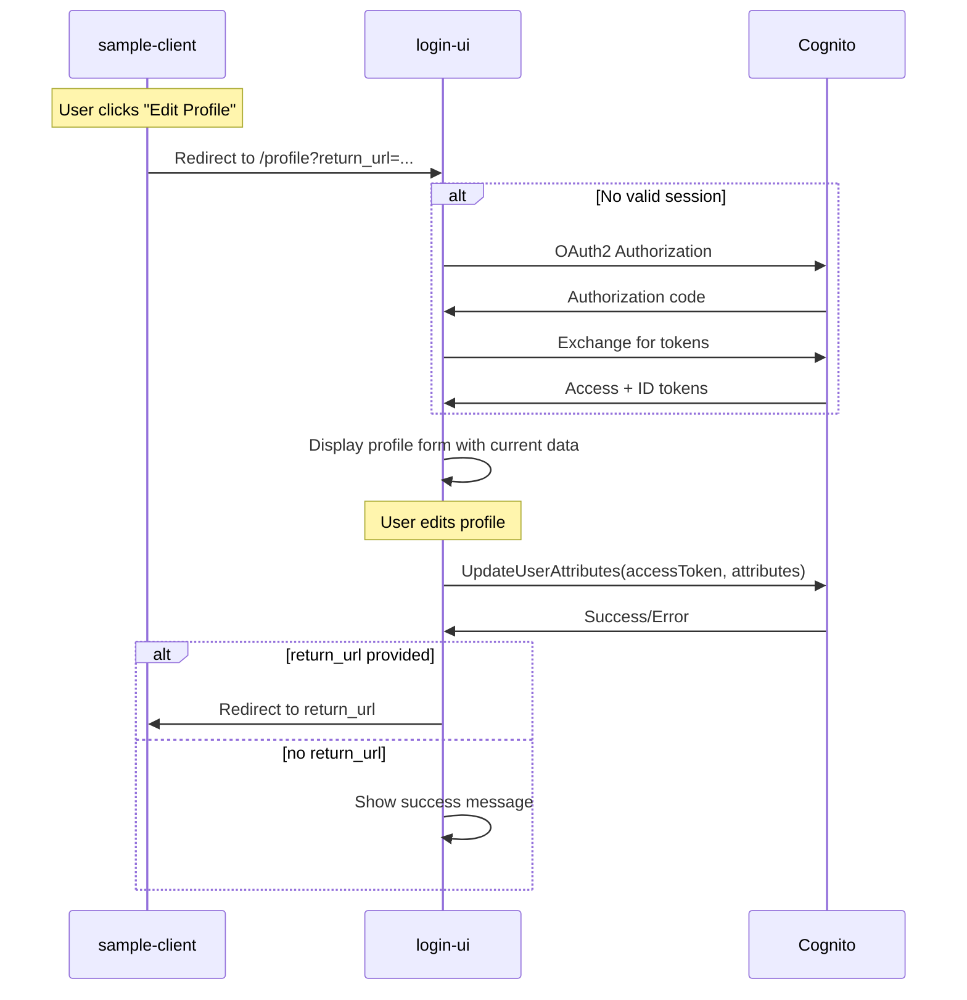

# Design Document: User Profile Management

## Overview

This design describes the implementation of a centralized User Profile Management page in the login-ui application. The profile page enables authenticated users to view and update their profile attributes (DisplayName, FirstName, LastName, Interests) using the Cognito UpdateUserAttributes API. Client applications redirect users to this page for profile management, creating a consistent experience across all TheSafeZone applications.

The implementation follows the existing login-ui patterns, using the same component library, styling, and OAuth2 authentication flow established for device activation.

## Architecture



## Components and Interfaces

### New Files

| File | Purpose |
|------|---------|
| `login-ui/src/pages/ProfilePage.tsx` | Profile management page component |
| `login-ui/src/services/profile.ts` | Profile update service using Cognito SDK |
| `login-ui/src/services/auth.ts` | OAuth2 authentication service for login-ui |

### ProfilePage Component

```typescript
interface ProfilePageProps {
  // No props - uses URL params and auth context
}

interface ProfileFormData {
  displayName: string;
  firstName: string;
  lastName: string;
  interests: string[];
}
```

### Profile Service Interface

```typescript
interface ProfileService {
  updateUserAttributes(
    accessToken: string,
    attributes: ProfileAttributes
  ): Promise<UpdateResult>;
}

interface ProfileAttributes {
  displayName?: string;
  firstName?: string;
  lastName?: string;
  interests?: string[];
}

interface UpdateResult {
  success: boolean;
  error?: string;
}
```

### Auth Service Interface

```typescript
interface AuthService {
  initiateLogin(returnPath: string): void;
  handleCallback(code: string, state: string): Promise<AuthState>;
  getAuthState(): AuthState | null;
  isAuthenticated(): boolean;
  refreshTokens(): Promise<AuthState>;
}

interface AuthState {
  accessToken: string;
  idToken: string;
  refreshToken?: string;
  expiresAt: number;
  userProfile: UserProfile;
}

interface UserProfile {
  sub: string;
  email?: string;
  displayName?: string;
  firstName?: string;
  lastName?: string;
  interests?: string[];
}
```

## Data Models

### Cognito Custom Attributes Mapping

| UI Field | Cognito Attribute | Type |
|----------|-------------------|------|
| Display Name | `custom:displayName` | string |
| First Name | `custom:firstName` | string |
| Last Name | `custom:lastName` | string |
| Interests | `custom:interests` | JSON string (array) |

### URL Parameters

| Parameter | Purpose | Example |
|-----------|---------|---------|
| `return_url` | Where to redirect after profile update | `https://sample.thesafezone.com/profile` |

### Allowed Return URL Origins

For security, only trusted origins are allowed for return_url redirects:
- Same origin (login-ui domain)
- Configured trusted domains from environment variable


## Correctness Properties

*A property is a characteristic or behavior that should hold true across all valid executions of a system-essentially, a formal statement about what the system should do. Properties serve as the bridge between human-readable specifications and machine-verifiable correctness guarantees.*

### Property 1: Authentication Guard

*For any* unauthenticated user state, when accessing the /profile route, the system should initiate an OAuth2 redirect to Cognito Managed Login rather than displaying the profile form.

**Validates: Requirements 1.2, 5.1**

### Property 2: Profile Data Display Consistency

*For any* valid user profile containing DisplayName, FirstName, LastName, and Interests, when the profile page renders, all non-null profile fields should appear in the corresponding form inputs.

**Validates: Requirements 1.3**

### Property 3: Partial Update Field Handling

*For any* subset of profile fields provided in an update, only the provided fields should be included in the UpdateUserAttributes API call, and unchanged fields should retain their original values.

**Validates: Requirements 2.4**

### Property 4: Interests Serialization Round-Trip

*For any* array of interest strings, serializing to JSON and deserializing should produce an equivalent array. The serialized format stored in `custom:interests` should be valid JSON.

**Validates: Requirements 2.5**

### Property 5: Untrusted Origin Rejection

*For any* return_url that is not from a trusted origin (same origin or configured trusted domains), the system should reject the redirect and display an error message instead of redirecting.

**Validates: Requirements 3.4**

## Error Handling

| Error Scenario | Handling |
|----------------|----------|
| No authentication | Redirect to Cognito OAuth2 flow with return path |
| Token expired | Attempt refresh; if fails, redirect to re-authenticate |
| UpdateUserAttributes fails | Display error message from Cognito response |
| Invalid return_url | Display error, do not redirect |
| Network error | Display generic error with retry option |

### Error Messages

```typescript
const ERROR_MESSAGES = {
  AUTH_REQUIRED: 'Please sign in to manage your profile.',
  UPDATE_FAILED: 'Failed to update profile. Please try again.',
  INVALID_RETURN_URL: 'Invalid redirect URL. Cannot return to the requested application.',
  NETWORK_ERROR: 'Network error. Please check your connection and try again.',
  TOKEN_EXPIRED: 'Your session has expired. Please sign in again.',
};
```

## Testing Strategy

### Unit Testing

Unit tests will cover:
- ProfilePage component rendering with various profile states
- Form validation and submission handling
- Auth service token management
- Profile service API calls
- URL parameter parsing and validation

### Property-Based Testing

Property-based tests will use `fast-check` library (already available in the project's test setup) to verify:

1. **Authentication Guard Property**: Generate random unauthenticated states and verify redirect behavior
2. **Profile Data Display Property**: Generate random valid profiles and verify all fields render
3. **Partial Update Property**: Generate random subsets of fields and verify only those are sent
4. **Interests Serialization Property**: Generate random string arrays and verify JSON round-trip
5. **Untrusted Origin Property**: Generate random URLs and verify trusted/untrusted classification

Each property-based test will:
- Run a minimum of 100 iterations
- Be tagged with the format: `**Feature: user-profile-management, Property {number}: {property_text}**`
- Reference the specific correctness property from this design document

### Test File Structure

```
login-ui/src/
├── pages/
│   ├── ProfilePage.tsx
│   └── ProfilePage.test.tsx      # Unit + property tests
├── services/
│   ├── profile.ts
│   ├── profile.test.ts           # Unit + property tests
│   ├── auth.ts
│   └── auth.test.ts              # Unit tests
└── utils/
    ├── urlValidation.ts
    └── urlValidation.test.ts     # Property tests for origin validation
```
